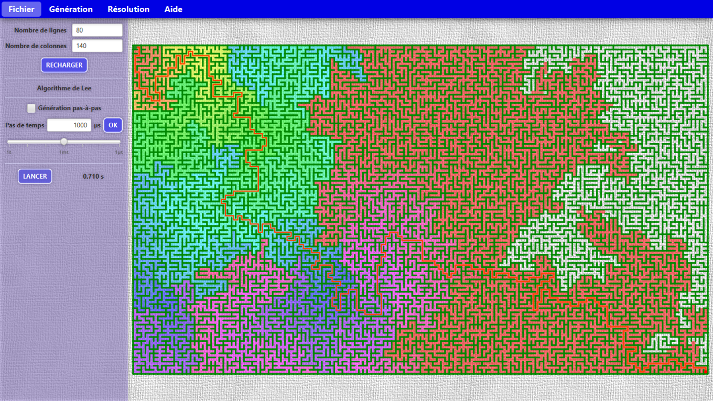

# Mazette

**Maze generator and solver using different algorithms**

------

The aim is to display every known algorithm step by step for educational purposes. By the way, the source code aims to be as modular as possible to enlighten the code and re-use some of its components (cf. the abstract class Algorithm).

The software proposes several functionalities:
 * Running algorithms via a command bar; those algorithms can be run **directly** or **step by step**.
 * Customising maze processing (size, duration between two steps, etc.)

## Implemented generation algorithms

All those algorithms are based on the [excellent site from Jamis Buck](http://weblog.jamisbuck.org/2011/2/7/maze-generation-algorithm-recap), doing a very complete state-of-the-art of the mathematical problem, except for the last two algorithms. The former goes around in my head since 2019 (some little ideas went in my head in 2009 when I began studying mazes but I began working seriously on it in 2020) and the latter came to my head in 2021 while studying line rasterization.

- [X] Kruskal (basic algorithm + alternative version with array sort)
- [X] Recursive backtracking
- [X] Recursive division
- [X] Hunt-and-Kill (or HK)
- [ ] Eller
- [X] Prim
- [X] Aldous-Broder
- [X] Wilson
- [ ] Growing tree
- [X] Binary tree
- [ ] Sidewinder
- [X] Personal algorithm (name still to define 😊)
- [ ] Personal algorithm #2 (will probably be called the "Mikado algorithm")

## Implemented solving algorithms

The list can be modified, as it simply comes from the [Wikipedia page](https://en.wikipedia.org/wiki/Maze_solving_algorithm).

- [ ] A* (or A-star)
- [ ] Wall following
- [ ] Breadth-first search
- [ ] Pledge
- [ ] Trémeaux
- [ ] Dead-end filling
- [ ] Maze-routing

------

## Features that need to be implemented in the future

 * Saving mazes as an image in many formats (PNG, JPEG, TIFF, SVG, PDF)
 * Color pickers for each maze part
 * Color map for pathfinding algorithms, which clarifies the target from start point to the finish.
